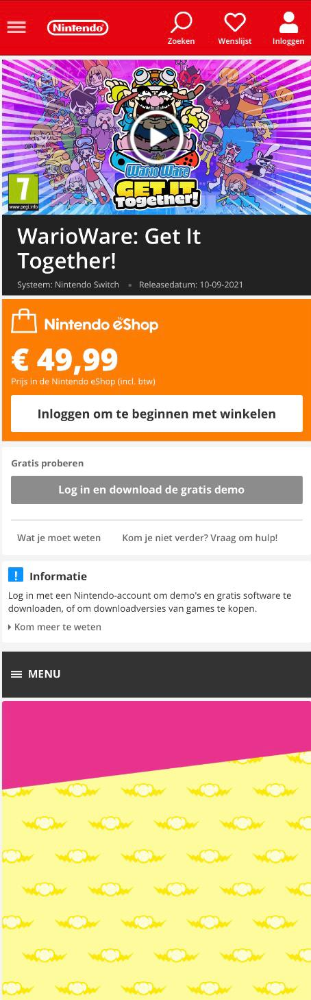
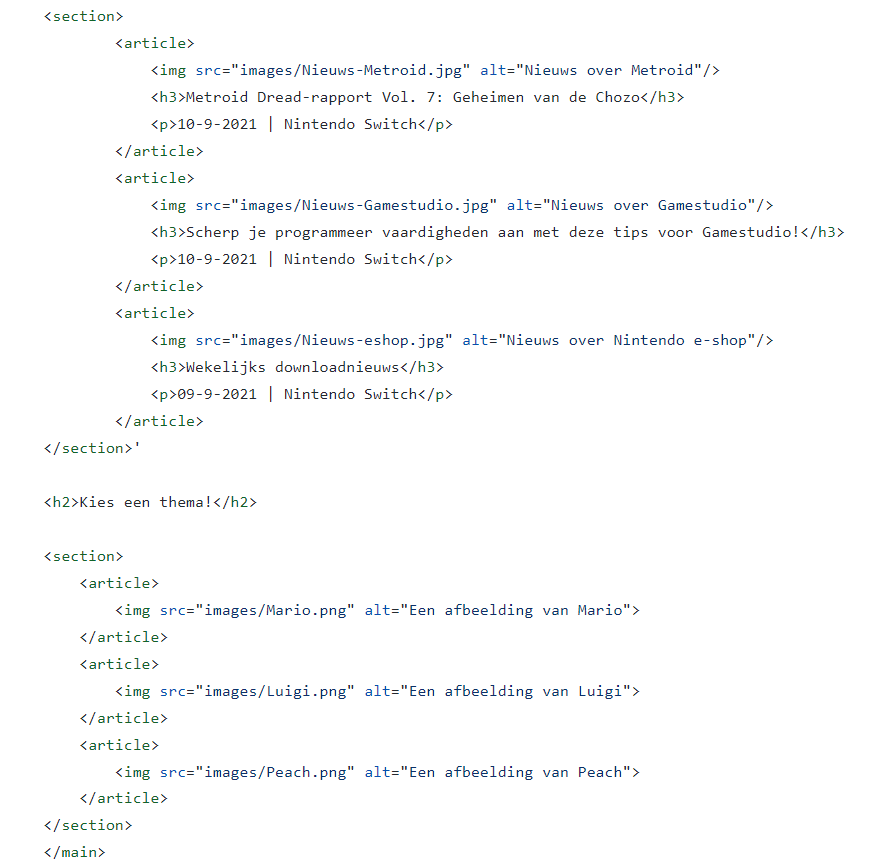

# Procesverslag
Markdown is een simpele manier om HTML te schrijven.  
Markdown cheat cheet: [Hulp bij het schrijven van Markdown](https://github.com/adam-p/markdown-here/wiki/Markdown-Cheatsheet).

Nb. De standaardstructuur en de spartaanse opmaak van de README.md zijn helemaal prima. Het gaat om de inhoud van je procesverslag. Besteedt de tijd voor pracht en praal aan je website.

Nb. Door *open* toe te voegen aan een *details* element kun je deze standaard open zetten. Fijn om dat steeds voor de relevante stuk(ken) te doen.

## Jij

uitwerken voor kick-off werkgroep

### Auteur:
Denise Radstaat

#### Je startniveau:
Blauw

#### Je focus:
Responsive
 

## Je website

uitwerken voor kick-off werkgroep

### Je opdracht:
https://www.nintendo.nl/

#### Screenshot(s) van de eerste pagina (small screen): 
Home pagina 

#### Screenshot(s) van de tweede pagina (small screen):
Detail pagina

 

## Breakdownschets (week 1)

uitwerken na afloop 2e werkgroep

### de hele pagina: 

Een schets die ik tijdens de les gemaakt heb voor de homepagina van mijn website.

### dynamisch deel (bijv menu): 

Een schets die laat zien hoe ik de content wil verdelen op een iPad- en desktop formaat.

## Voortgang 1 (week 2)

uitwerken voor 1e voortgang

### Stand van zaken
Ik ben begonnen met de HTML van website. Verder dan dit ben ik nog niet gekomen. Ik zou graag willen weten hoe
ver ik op dit moment moet zijn met mijn site zodat ik een planning kan maken. Ik kwam erachter dat mijn groepje dezelfde vraag had.

### Verslag van meeting

We hebben het tijdens het voortgangsgesprek voornamelijk over de planning gehad. We moeten nu ongeveer een site hebben met een header, footer en wat content. Dat betekent dat ik achterloop en ik binnenkort even wat meer tijd moet besteden aan mijn website. De docent gaf ons de tip om de opdrachten die we tijdens de les doen meteen te verwerken in mijn website. Dat scheelt tijd, omdat ik op het moment dat ik de opdrachten doe al met de stof bezig ben.

Verder heb ik mijn HTML code van wat ik tot nu toe heb, laten zien aan de docent. De HTML was goed, alhoewel ik de afbeeldingen nog in articles kan zetten. Ook kan ik buttons zetten onder de afbeelding, zodat de afbeelding klikbaar wordt. Dan kan ik de button in de afbeelding positioneren, zoals we in de les geoefend hebben.

Verder viel het onze docent op bij mijn groepsgenoten dat ze veel verschillende classlists hebben gebruikt in de CSS. De docent zei dat we de andere selectors moeten uitproberen en we niet alleen verschillende classlists kunnen gebruiken. Hier ga ik dan ook op letten als ik ga beginnen aan de CSS.

## Voortgang 2 (week 3)

uitwerken voor 2e voortgang

### Stand van zaken
hier dit ging goed & dit was lastig (neem ook screenshots op van delen van je website en code)

Ik heb een deze week een deel kunnen inhalen, maar ik loop nog steeds erg achter. Daarom wil ik me de komende tijd
extra focussen op dit vak. Het is me wel gelukt om een header te maken voor mijn site. Daar had ik in het begin veel moeite mee,
omdat ik het niet goed voor elkaar kreeg om het logo links te krijgen en de iconen in de header juist rechts.

### Verslag van meeting
Tijdens de meeting heeft de student-assistent naar mijn code gekeken. Ze heeft een aantal kleine foutjes eruit gehaald, zoals delen waar ik niet goed had ingesprongen. Ze zei ook dat ik goed moest opletten dat ik op de juiste manier h1, h2 en h3 gebruik. Aan het einde vroeg ze aan mij wat mijn planning is voor de komende weken. Ik legde haar uit dat ik de komende week me ga focussen op dit vak en in ieder geval de homepagina goed uitgewerkt wil hebben voor de toegankelijkheidstest. Ze vond het een goed idee.

## Toegankelijkheidstest (week 4)

uitwerken na test in 8e voortgang

### Bevindingen
Lijst met je bevindingen die in de test naar voren kwamen:
1. Verdwaald met de screenreader.
2. Niet overal naartoe tabben
3. Lastige leesbare teksten.

#### Verdwaald met de screenreader

Hier korte omschrijving (met indien nodig een afbeelding)
Ik ging met mijn klasgenoot kijken hoe mijn site werkt met het gebruiken van een screenreader. Dat bleek lastiger te zijn dan gedacht, omdat de screenreader vaak dingen niet goed uitsprak of veel onnodige dingen uitsprak. In de header zegt hij bijvoorbeeld wel wat het icoon is, maar niet dat de gebruiker ook kan inloggen. Verder was het ook niet duidelijk dat in het grid verschillende games staan. 

Hier een omschrijving van hoe het opgelost kan worden (met indien nodig een afbeelding)
Nogmaals kijken en blijven testen hoe ik mijn site het beste kan ontwerpen voor een screenreader. Bijvoorbeeld een titel toevoegen bij het grid zodat de gebruiker weet dat het over verschillende games gaat. Ik zou ook in de Alt tekst van de iconen kunnen zetten dat het om een link gaat.

#### Niet overal naartoe tabben. 
Hier korte omschrijving (met indien nodig een afbeelding)
Tijdens de test kwam naar voren dat het tabben niet lekker werkt. Er worden stukken in de site overgeslagen. 

Hier een omschrijving van hoe het opgelost kan worden (met indien nodig een afbeelding)
Ik denk dat dit op te lossen is door meer linkjes en knoppen toe te voegen in mijn site. Dit had ik tijdens de test nog niet bij alles gedaan, waardoor er stukken werden overgeslagen.

#### Lastig leesbare teksten

Hier korte omschrijving (met indien nodig een afbeelding)
Tijdens de test met de ballon en de bril met vlekken erin bleek dat sommige tekst lastig te lezen was. Bijvoorbeeld de hover tekst in de header en de tekst onder de afbeeldingen bij het kopje nieuws.

Hier een omschrijving van hoe het opgelost kan worden (met indien nodig een afbeelding)
Dit zou ik op kunnen lossen door een andere manier toe te passen voor de hover tekst dan ik nu gedaan heb en de tekstgrootte aan te passen.

## Voortgang 3 (week 4)

uitwerken voor 3e voortgang

### Stand van zaken

Ik heb veel ingehaald de afgelopen week en ik sta er nu goed voor. Ik heb alle content van de homepagina nu toegevoegd aan mijn site. Ik begon met het maken van een grid waar alle games in staan. Die is nu af en responsive. Daarnaast heb ik een footer toegevoegd en drie buttons waarmee je d.m.v. javascript het thema van de site kan aanpassen. De knoppen werken alleen nog niet helemaal, omdat ik eerst een thema moet uitzetten en dan pas een nieuwe kan aanzetten. Ik wil vragen tijdens het gesprek hoe ik dit kan oplossen. In de komende week wil ik de tweede pagina maken en states toevoegen aan mijn site.

### Verslag van meeting
De docent heeft mij geholpen met mijn thema's. Ik heb nu een classList.remove toegevoegd aan de functies en gezegd dat hij eerst de andere classes moet verwijderen, voordat hij het nieuwe thema toevoegt. Verder moet ik nog de laatste paar dingen toevoegen aan mijn site en een tweede pagina maken. Daar ga ik me dan de komende tijd op focussen.

## Eindgesprek (week 5)

uitwerken voor eindgesprek

### Stand van zaken
hier dit ging goed & dit was lastig (neem ook screenshots op van delen van je website en code)

### Screenshot(s)

hier screenshot(s) van je eindresultaat

## Bronnenlijst

continu bijhouden terwijl je werkt

Nb. Wees specifiek ('css-tricks' als bron is bijv. niet specifiek genoeg).

1. HTML Color Codes (z.d.) Get HTML color codes, Hex color codes, RGB and HSL values with our color picker, color chart and HTML color names. Let's go! Geraadpleegd via: https://htmlcolorcodes.com/ 
Bron gebruikt voor kleurcodes op te zoeken.
2. Super Mario Wiki (z.d.) File:Mario switch icon.png [Foto] Geraadpleegd via: https://www.mariowiki.com/File:Mario_switch_icon.png
Bron gebruikt voor thema icoon van Mario.
3. Super Mario Wiki (z.d.) File:Luigi switch icon.png [Foto] Geraadpleegd via: https://www.mariowiki.com/File:Luigi_switch_icon.png
Bron gebruikt voor thema icoon van Luigi.
4. Super Mario Wiki (z.d.) File:Peach switch icon.png [Foto] Geraadpleegd via: https://www.mariowiki.com/File:Peach_switch_icon.png
Bron gebruikt voor thema icoon van Peach.

